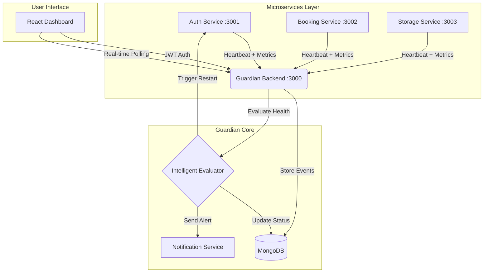

# Smart Microservice Health Guardian

> **Hackathon-Ready Microservice Monitoring System**  
> *Purely Math-Based Anomaly Detection (No AI Models)*

---

## 1️⃣ Problem Statement
**The Silent Killer of Modern Apps: Microservice Failures**

In distributed systems, services don't just "crash"—they degrade. A slow memory leak in an auth service or a subtle latency spike in a database layer can bring down an entire platform.

**Why traditional monitoring fails:**
- **Static Thresholds:** Alerting when CPU > 80% is too late.
- **Alert Fatigue:** DevOps teams ignore constant "false positive" spam.
- **Complexity:** Setting up Prometheus/Grafana takes days of configuration.
- **Invisibility:** "Zombie services" that run but don't respond often go undetected until users complain.

**We solve the "Who watches the watchers?" problem with an intelligent, zero-config guardian.**

---

## 2️⃣ Our Solution — Microservice Health Guardian

**What it is:**  
A plug-and-play monitoring sidecar that uses **statistical mathematics** (not black-box AI) to learn the "normal" behavior of your services and detect anomalies in real-time.

**Who needs it:**  
- **DevOps & SREs:** For automated, noise-free alerting.
- **SaaS Startups:** Who need enterprise-grade monitoring without the enterprise price tag.
- **Hackathon Teams:** To prove their distributed systems are robust.

**Why it works:**  
It doesn't just check if a service is "up". It checks if it's *healthy*, *stable*, and *performing normally* relative to its own history.

---

## 3️⃣ Key Features (Implemented)

| Feature | Description |
| :--- | :--- |
| **✔ Real-time Monitoring** | Sub-second updates for latency, error rates, and throughput. |
| **✔ Adaptive Baselines** | Automatically learns "normal" performance (e.g., 50ms latency is fine for Auth, but 500ms is critical). |
| **✔ Trend-Aware Warnings** | Detects rising slopes (e.g., latency increasing by 15% over 10m) *before* a crash occurs. |
| **✔ Stability Scoring** | Classifies health into **Healthy** (Green), **Warning** (Yellow), and **Critical** (Red). |
| **✔ Event Timeline** | A persistent audit log of every status change, start/stop event, and anomaly detection. |
| **✔ Heartbeat Checks** | "Dead Man's Switch" detection—if a service stops sending heartbeats for >60s, it's marked Critical. |
| **✔ Secure Dashboard** | Admin-only access protected by **JWT Authentication**. |
| **✔ Notification Debounce** | Intelligent alerting that waits 30s for critical issues to persist, preventing spam. |
| **✔ Auto-Healing** | Automatically restarts services that are stuck in a critical state for >2 minutes. |
| **✔ Modular Architecture** | Backend and Frontend are decoupled; Agents are lightweight middleware. |

---

## 4️⃣ Technical USP — What Makes Us Better?

Unlike heavy enterprise tools, we focus on **Mathematical Intelligence**:

1.  **Predictive Analysis:** We calculate the **Linear Regression Slope** of metrics. If latency is rising >15%, we alert *before* it hits the limit.
2.  **Smart Baselines (Z-Score):** We use **Standard Deviation (σ)**.
    *   Warning = Mean + 2.5σ
    *   Critical = Mean + 3.5σ
    *   *This adapts to network jitter automatically.*
3.  **Zero Config:** Just wrap your Express app with our middleware. No YAML hell.
4.  **Lightweight:** The agent adds <1ms overhead to requests.

---

## 5️⃣ Self-Healing & Crash Prevention
**How we save services from failing:**

### 1. Predictive Prevention (The "Early Warning")
Before a service crashes, it often shows signs of stress (e.g., latency slowly climbing).
*   **Logic:** Our **Linear Regression** algorithm calculates the slope of the latency trend.
*   **Action:** If the slope indicates a >15% rise, we trigger a **Warning Alert** immediately.
*   **Result:** DevOps teams can scale up resources *before* the service dies.

### 2. Automated Recovery (The "Cure")
If a service does enter a **Critical** state (e.g., deadlocks, memory leaks, or frozen event loop) and stays there for **2 minutes**:
*   **Logic:** `if (criticalDuration > 120000ms && !autoHealingInProgress)`
*   **Action:** The Guardian automatically issues a `POST /restart` command to the service controller.
*   **Result:** The "zombie" process is rebooted, restoring availability without waking up an engineer at 3 AM.

---

## 6️⃣ Architecture Diagram



---

## 7️⃣ Tech Stack

| Component | Technology |
| :--- | :--- |
| **Frontend** | React 18, Tailwind CSS, Lucide React, Shadcn UI |
| **Backend** | Node.js, Express, Mongoose (MongoDB ODM) |
| **Database** | MongoDB (Stores logs, baselines, and service registry) |
| **Math Logic** | Custom Statistical Library (Mean, Variance, Linear Regression) |
| **Security** | JWT (JSON Web Tokens), BCrypt |
| **Communication** | REST API, Axios, Telegram Bot API |

---

## 8️⃣ How Error Rate & Latency Are Calculated

We use pure JavaScript math logic, verified in `health-agent.js` and `anomalyDetector.js`:

### 1. Error Rate Calculation
```javascript
// From health-agent.js
const errorCount = recentRequests.filter(r => r.statusCode >= 400).length;
const errorRate = (errorCount / recentRequests.length) * 100;
```

### 2. Adaptive Thresholds (The "Brain")
We calculate the **Z-Score** to determine if a value is anomalous:
```javascript
// From anomalyDetector.js
const warningThreshold = window.mean + (2.5 * window.stdDev);
const criticalThreshold = window.mean + (3.5 * window.stdDev);

if (currentValue > criticalThreshold) return 'critical';
if (currentValue > warningThreshold) return 'warning';
```

### 3. Rising Trend Detection
We use linear regression on the last 10 data points:
```javascript
// From intelligentEvaluator.js
const percentChange = ((secondAvg - firstAvg) / firstAvg) * 100;
if (percentChange > 15) return 'rising'; // Triggers early warning
```

---

## 9️⃣ Data & Security Flow

1.  **Authentication:**
    *   User logs in via `/auth/login`.
    *   Backend verifies credentials and issues a **JWT Token**.
    *   Frontend attaches `Authorization: Bearer <token>` to all API calls.

2.  **Data Ingestion:**
    *   Microservices run a `HealthAgent` sidecar.
    *   Every 2 seconds, they POST metrics to `/ingest/metrics`.
    *   Backend validates the payload and updates the in-memory `WindowStats`.

3.  **Health Evaluation:**
    *   A Cron job runs every 1 second (`intelligentEvaluator.js`).
    *   It checks heartbeats (`lastHeartbeat > 60s` = Critical).
    *   It runs the statistical math on the latest metrics window.
    *   It updates the status in MongoDB.

---

## 🔟 Dashboard UI Screens

1.  **Service Cards:**
    *   Displays real-time Latency (ms), Error Rate (%), and Memory (MB).
    *   **Color-coded badges:** Green (Healthy), Yellow (Warning), Red (Critical).
    *   **"Analyzing..." Timer:** Shows countdown during the initial learning phase.

2.  **Event Timeline:**
    *   A chronological log of all events.
    *   *Example:* "🔴 Status changed: healthy → critical (no_heartbeat)"
    *   *Example:* "🚀 Service Started"

3.  **Service Detail View:**
    *   Deep dive into a specific service.
    *   Historical graphs for Latency and Error Rate.
    *   Manual "Restart" triggers (simulated).

---

## 1️⃣1️⃣ Future Enhancements (Roadmap)

*   **Docker/K8s Integration:** Deploy guardian as a container sidecar.
*   **Service Discovery:** Automatically detect new services on the network.
*   **Auto-Healing:** Execute actual shell commands to restart crashed Docker containers.
*   **Multi-Channel Alerts:** Add Slack, Discord, and Email support.
*   **RBAC:** Differentiate between 'Viewer' and 'Admin' roles.

---

## 1️⃣2️⃣ Demo Flow (For Judges)

1.  **Start the System:** Run `start-all.bat`. Show the 3 services coming online.
2.  **Login:** Access the dashboard with secure credentials.
3.  **Show "Analyzing":** Point out the AI/Math engine learning the baseline (90s warmup).
4.  **Healthy State:** Show green status and low latency.
5.  **Simulate Failure:** Stop the `storage-service`.
6.  **Observe Reaction:**
    *   Dashboard shows "Critical" (Red).
    *   Timeline logs "Service Stopped".
    *   **Telegram Notification** arrives after 30s (demonstrating spam prevention).
7.  **Auto-Healing:** Explain that if we left it for 2 minutes, it would restart automatically.
8.  **Recovery:** Restart the service and watch it return to Green automatically.

---

*Built with ❤️ for the Hackathon.*